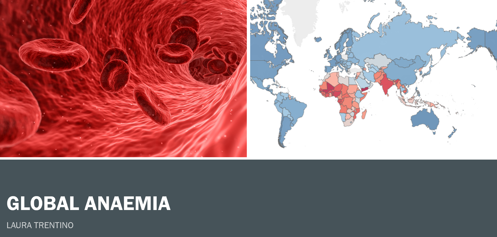
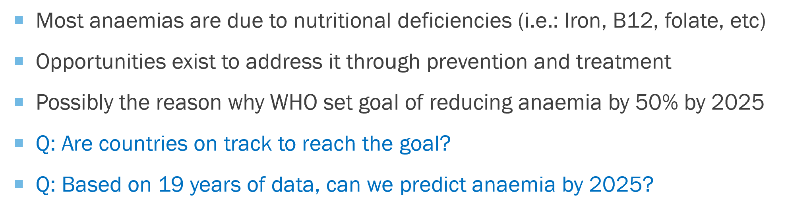
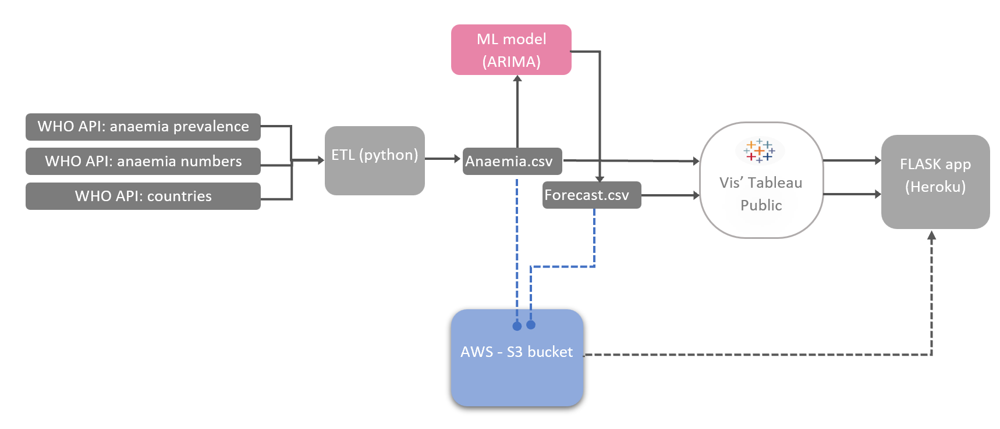
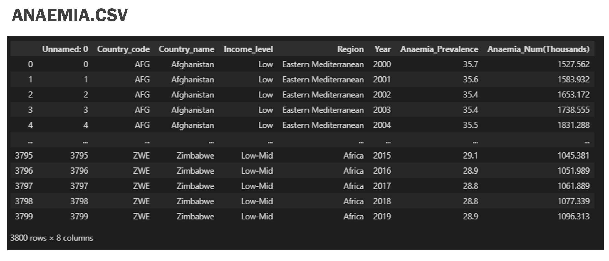
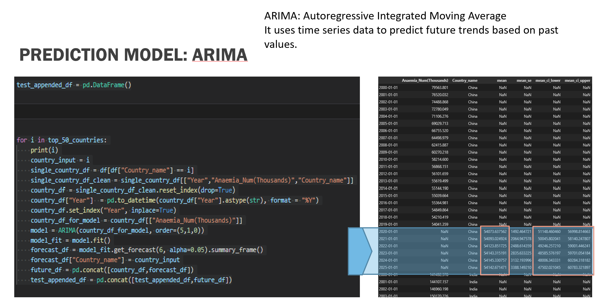
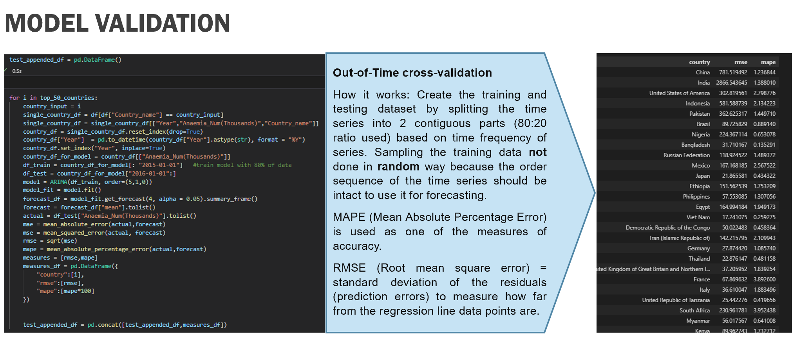
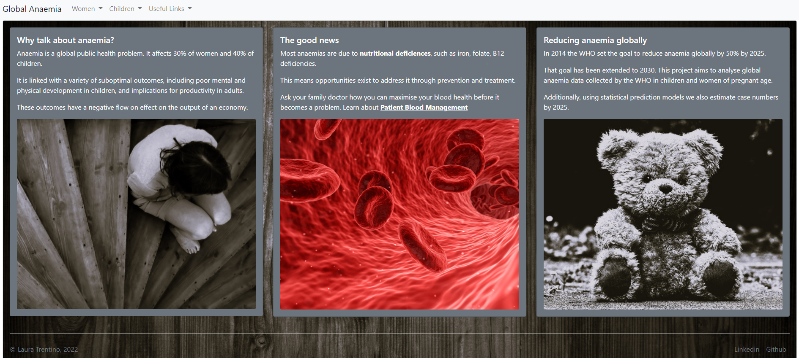
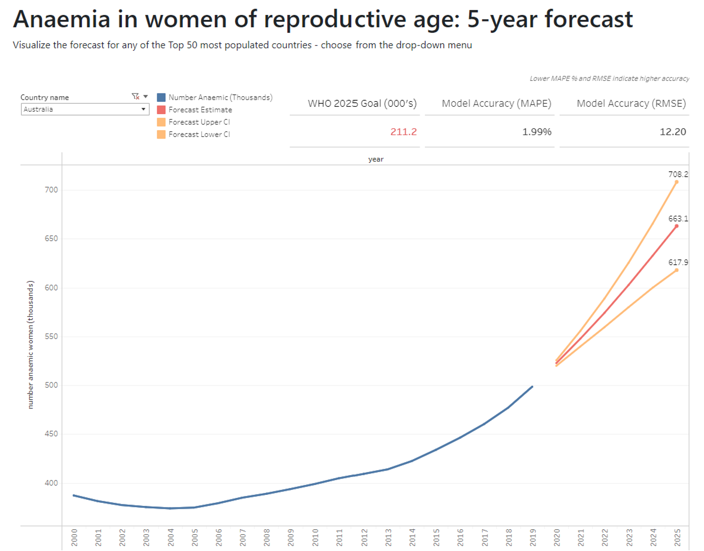

# GLOBAL ANAEMIA PROJECT


# Purpose

This project creates a machine learning model to forecast global anaemia, and allows users to interact with Tableau dashboards.
This project aims to extend the global anaemia project presented at UWA Data Analysis Bootcamp.


# Motivation

Anaemia is a serious global public health problem that particularly affects young children and women. WHO estimates that 42% of children less than 5 years of age and 40% of pregnant women worldwide are anaemic. (https://www.who.int/health-topics/anaemia#tab=tab_1)



# Data source

The WHO odata api (https://www.who.int/data/gho/info/gho-odata-api) was used to retrieve 19 years of data (2000 to 2019) at the country level, for women and children.


# Machine learning model

An ARIMA model was used to forecast time series. Based on the World Health Organization target of reducing anaemia by 50% by 2025 (see policy brief https://apps.who.int/iris/bitstream/handle/10665/148556/WHO_NMH_NHD_14.4_eng.pdf?ua=1), a forcast of 5 years was selected. This was applied to a list of the top 50 most populated countries.

# App hosting

The demo app is hosted on Horoku: http://anaemia-project.herokuapp.com/
The endpoint website contains vizualisations done in Tableau public, feeding from the output csv files which are saved in a AWS bin.


# Repo structure 
```
images/                                     
app/
    |__ app.py                              # contains the main flask app logic and endpoints 
    |__ Procfile                            # tells Heroku/Elastic Beanstalk how to run the app 
    |__ requirements.txt                    # python dependencies for app 
    |__ build.bat                           # shell script to build the zip file (Not used if deploying to Heroku)
    static/images/                           # contains images used for the website and the README
    templates/                              # contains the html files        
resources/
    |__ countries_gdp_health.xlsx           # an WHO extract to determine countries gdp health
    |__ api_request_ETL.ipynb               # contains the code used to pull and prepare data
    |__ anaemia.csv                         # output from api_ETL used to feed Tableau dashboard
    |__ model.ipynb                         # contains the code used to forecast time series and to test performance
    |__ forecast.csv                        # output from model.ipynb used to feed Tableau dashboard
    |__ model_performance.csv               # output from model.ipynb used to test performance in Tableau dashboard
README.md                                   # all you need to know is in here 

```

# Screen shots of website presentation







# homepage appearance



# main interactive dashboard


# Interactive forecast dashboard
### The user can choose from a list of 50 countries. The forecast shows the estimate value and the 95% Confidence Interval.
### The dashboard also shows the relevant WHO target (50% reduction from year 2014)



# Deployment
This app is deployed on Heroku
https://anaemia-project.herokuapp.com/


