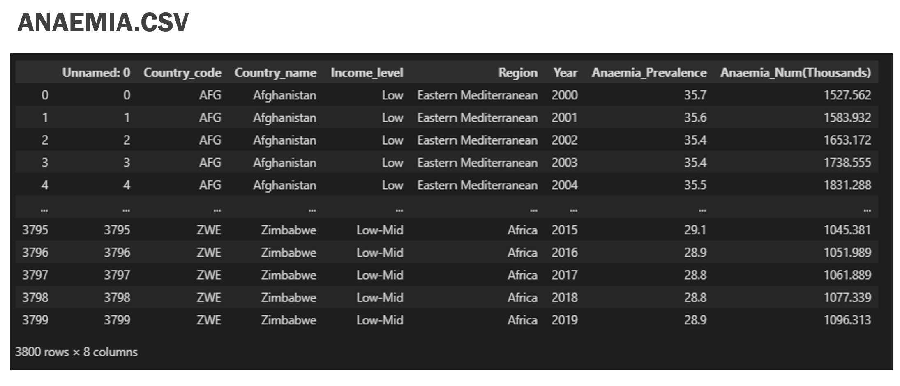
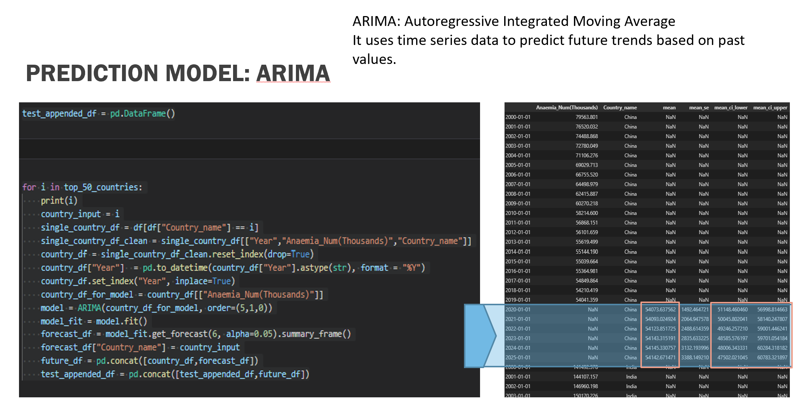
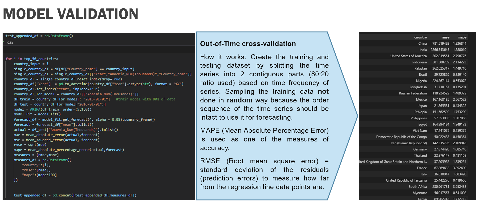
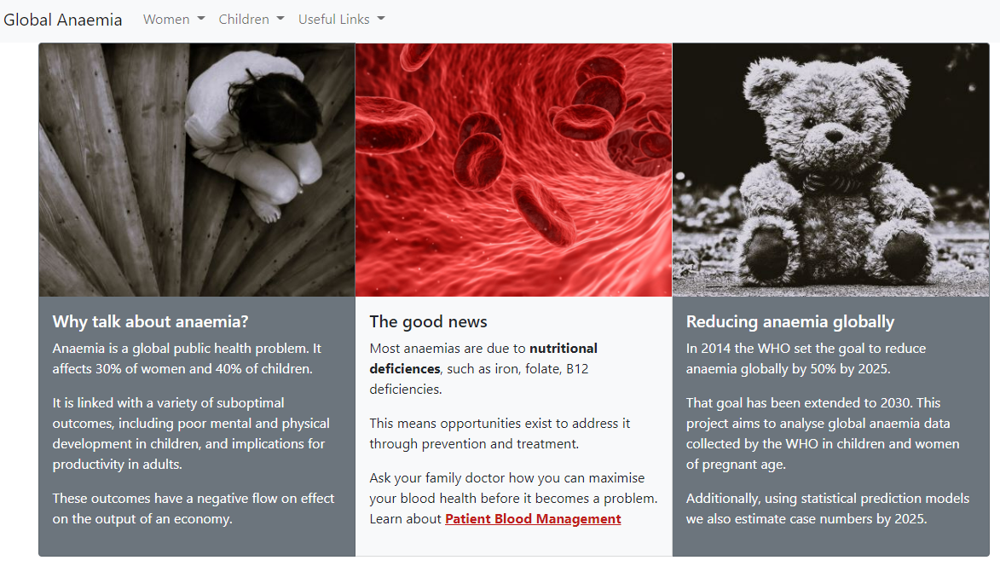
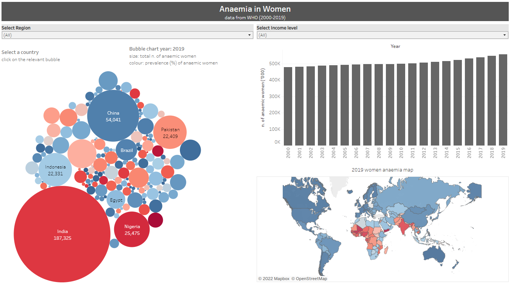
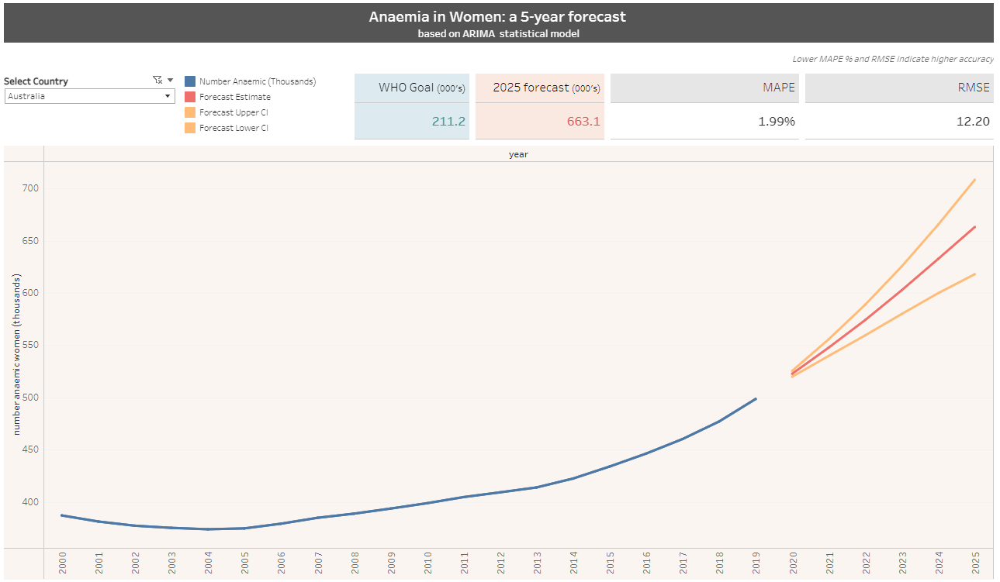

# GLOBAL ANAEMIA PROJECT 2021

# Purpose

This project creates a machine learning model to forecast global anaemia, and allows users to interact with Tableau dashboards.
Part of this project is to guide the user to some useful material to learn about anaemia and related patient blood management (https://ifpbm.org).


# Motivation

Anaemia is a serious global public health problem that particularly affects young children and women. WHO estimates that 42% of children less than 5 years of age and 40% of pregnant women worldwide are anaemic. (https://www.who.int/health-topics/anaemia#tab=tab_1)
Most anaemias are due to nutritional deficiencies (i.e.: Iron, B12, Folate, etc)
Opportunities exist to address it through prevention and treatment. Possibly this is the reason why the WHO set the goal of reducing anaemia globally by 50% by 2025. 
Are countries on track to reach the goal?
Based on 19 years of data, can we predict anaemia by 2025?


# Data source

The WHO odata api (https://www.who.int/data/gho/info/gho-odata-api) was used to retrieve 19 years of data (2000 to 2019) at the country level, for women and children.


# Machine learning model

An ARIMA model was used to forecast time series. Based on the World Health Organization target of reducing anaemia by 50% by 2025 (see policy brief https://apps.who.int/iris/bitstream/handle/10665/148556/WHO_NMH_NHD_14.4_eng.pdf?ua=1), a forcast of 5 years was selected. This was applied to a list of the top 50 most populated countries.

# Website hosting

The demo website is hosted on Github Pages: http://globalanaemia.github.io/
The endpoint website contains vizualisations done in Tableau public, feeding from the output csv files which are saved in a AWS bin.


# Repo structure 
```
.html pages
images/                                     
resources/
    |__ countries_gdp_health.xlsx           # an WHO extract to determine countries gdp health
    |__ api_request_ETL.ipynb               # contains the code used to pull and prepare data
    |__ anaemia.csv                         # output from api_ETL used to feed Tableau dashboard
    |__ model.ipynb                         # contains the code used to forecast time series and to test performance
    |__ forecast.csv                        # output from model.ipynb used to feed Tableau dashboard
    |__ model_performance.csv               # output from model.ipynb used to test performance in Tableau dashboard
README.md                                   # all you need to know is in here 

```

# Screen shots of website presentation





# homepage appearance



# main interactive dashboard



# Interactive forecast dashboard
### The user can choose from a list of 50 countries. The forecast shows the estimate value and the 95% Confidence Interval.
### The dashboard also shows the relevant WHO target (50% reduction from year 2014)
### Model validation is presented as MAPE and RMSE, where lower values indicate higher accuracy.



